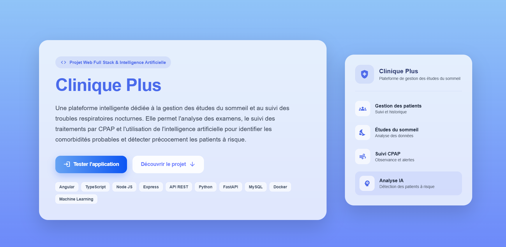
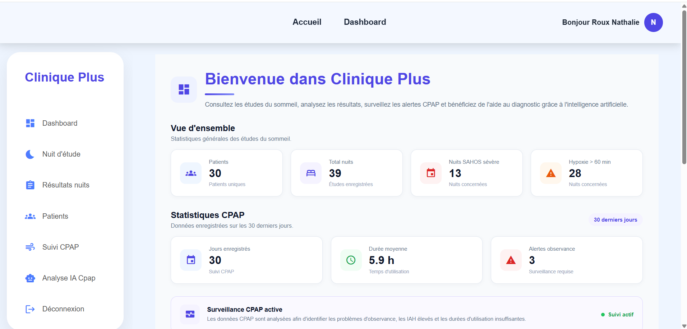
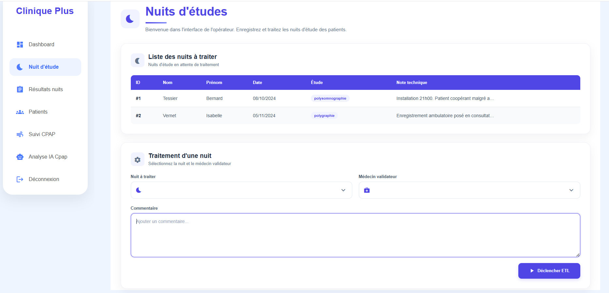
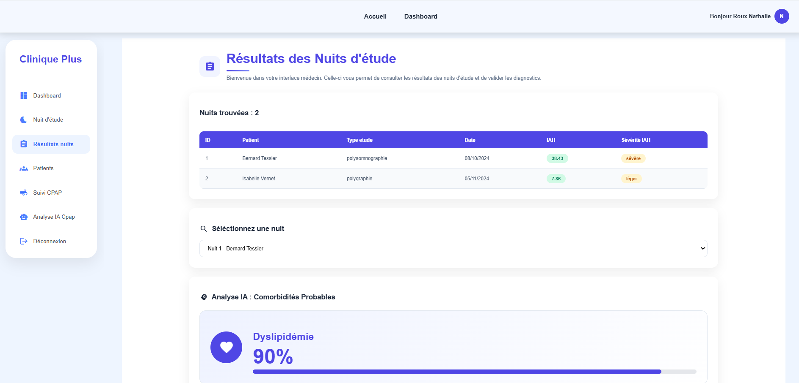
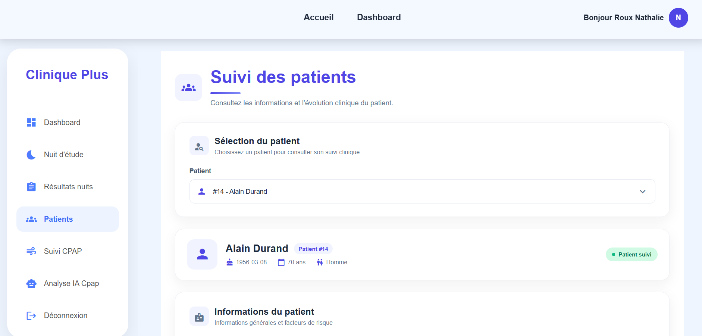
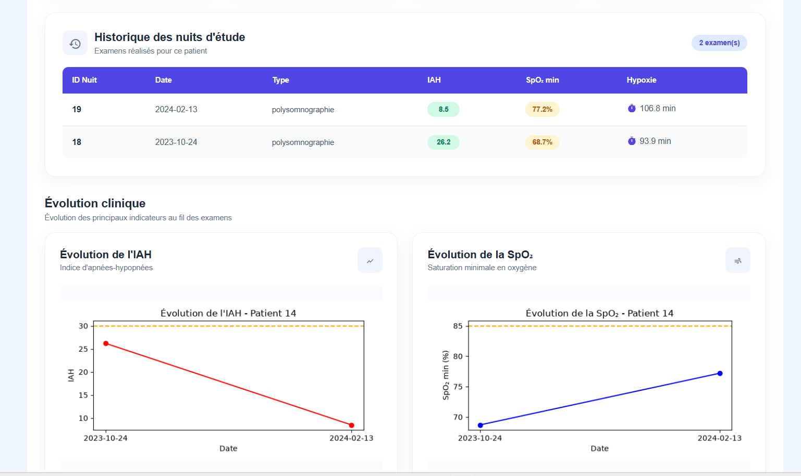
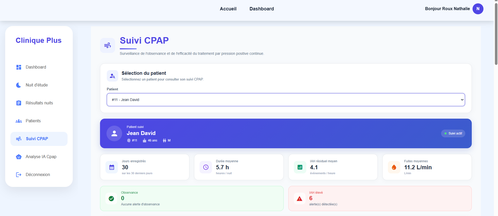
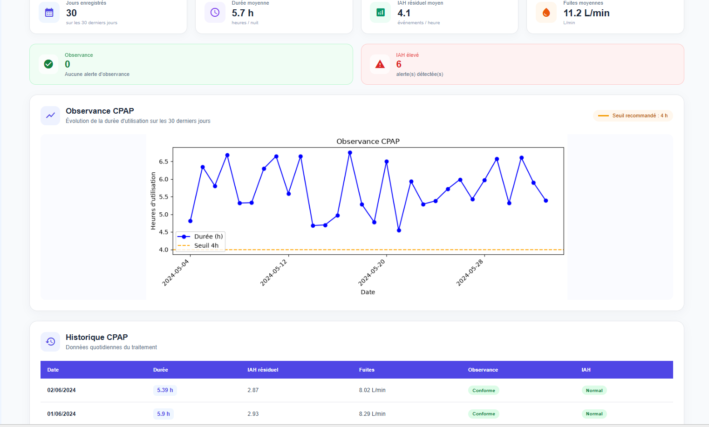
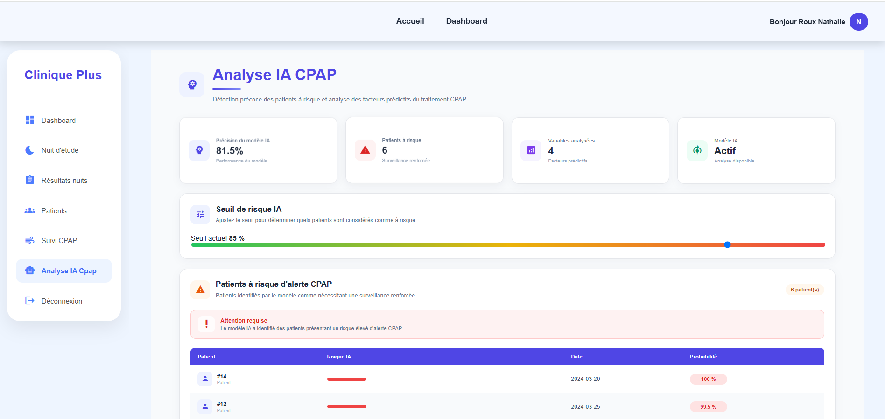

# Clinique Plus


---

# Présentation du projet

**Clinique Plus** est une application web conçue pour centraliser et exploiter les données issues des études du sommeil et du suivi des patients utilisant un traitement CPAP.

En effet, un traitement **CPAP** est utilisé dans le traitement de l'apnée du sommeil. C'est un appareil qui envoie un léger flux d'air dans un masque afin de permettre au patient de respirer librement.

Ainsi, l'application permet aux professionnels de santé de :

- consulter les informations des patients ;
- gérer les études du sommeil ;
- analyser les indicateurs cliniques ;
- suivre les traitements CPAP ;
- visualiser les alertes.

Une composante d'**intelligence artificielle** permet également :

- d'identifier des comorbidités probables pour un patient;
- de détecter les patients présentant un risque élevé d'alerte CPAP.

---

# Fonctionnalités de l'application

## Suivi des patients

- Consultation des patients ;
- Dossier Patient Informatisé (DPI) ;
- Informations générales et historique des nuits d'études ;
- Indicateurs cliniques.

---

## Gestion des études du sommeil

- Enregistrement des nuits d'étude ;
- Attribution d'un médecin validateur ;
- Ajout de commentaires techniques ;
- Traitement et validation des études ;
- ETL de calcul des indicateurs cliniques à partir des fichiers de résultats des appareils CPAP.

### Indicateurs cliniques

Les indicateurs calculés comprennent notamment :

- `SpO2`
- `ronflement_fort`
- `position_dominante`
- `duree_hypoxie`
- `nb_apnees`
- `nb_hypopnees`
- `nb_rera`
- `IAH`
- `nb_microeveils`
- `duree_hypoxie_min`
- etc.

- Génération de rapports et de courbes pour le patient.

---

## Résultats des nuits d'étude du sommeil

- Analyse de la SpO₂ ;
- Analyse du débit nasal ;
- Analyse des ronflements ;
- Analyse des événements respiratoires ;
- Consultation du rapport médical du patient ;
- Confirmation du diagnostic.

---

## Suivi CPAP

- Durée d'utilisation ;
- Observance ;
- IAH résiduel ;
- Fuites ;
- Détection des alertes ;
- Surveillance des patients.

---

## Intelligence artificielle

- Détection prédictive des patients à risque ;
- Calcul d'une probabilité de risque ;
- Identification de comorbidités probables pour un patient ;
- Analyse des variables prédictives ;
- Seuil de risque configurable ;
- Visualisation des facteurs influençant la prédiction.

---

## Rapports

- Génération automatique de rapports ;
- Export PDF ;
- Synthèse des résultats du patient.

---

# Aperçu de l'application

Voici quelques captures d'écran de l'application.

## Page d'accueil



## Tableau de bord



## Enregistrement d'une nuit étude



## Résultats d'une nuit étude



## Suivi d'un patient





## Suivi CPAP





## Analyse IA CPAP



---

# Architecture

| Composant | Rôle |
|---|---|
| **Angular** | Interface utilisateur |
| **Express Node.js** | API REST / Backend Gateway |
| **FastAPI** | API REST / Backend Microservice |
| **MySQL** | Stockage des données |
| **Service IA** | Analyse prédictive |
| **Base analytique** | Exploitation des données |
| **Génération PDF** | Création des rapports |
| **Docker** | Conteneurisation |

---

# Technologies utilisées

## Frontend

- Angular
- TypeScript
- HTML / SCSS
- Angular Material / Material Icons

## Backend

- Python
- FastAPI
- REST API
- Express Node.js

## Data / IA

- Python
- Pandas
- Scikit-learn
- Machine Learning

## Base de données

- MySQL

## Infrastructure

- Docker
- Docker Compose

## Outils

- Git
- GitHub

---

# Authentification et rôles

## Utilisateurs

L'application propose plusieurs profils :

- **Administrateur** : administrateur de la plateforme, crée les utilisateurs et leur attribue des rôles ;
- **Infirmier / Opérateur** : enregistre les nuits d'étude ;
- **Médecin** : assure le suivi des patients et confirme les diagnostics.

---

# Comptes de démonstration

Pour tester l'application :

| Profil | Identifiant | Mot de passe |
|---|---|---|
| Administrateur | `isabelle.faure@clinique-sommeil-arles.fr` | `azerty` |
| Médecin | `thomas.estrii@clinique-sommeil-arles.fr` | `azerty` |
| Infirmier | `nathalie.roux@clinique-sommeil-arles.fr` | `azerty` |

---

# Installation

Le projet a été réalisé avec **Docker** (voir le fichier `compose.yaml`).

Quatre conteneurs ont été créés :

- **`clinique-plus-api`** : Backend Gateway avec une API Express Node.js, exposant les ressources nécessaires au fonctionnement de l'application ;

- **`python-service`** : service Python FastAPI exposant les différents calculs et traitements IA ;

- **`clinique-plus-db-api-1`** : conteneur de la base de données MySQL ;

- **`angular-app`** : frontend développé avec le framework Angular pour l'interface utilisateur.

---

# Installation en local

## 1. Cloner le projet

```bash
git clone https://github.com/emfall2015/clinique-plus.git
cd clinique-plus
```

### 2. Configurer les variables d'environnement

Créer un fichier `.env` dans les dossiers `python-service` et `backend` en se basant sur le fichiers `.env.example`.

### 3. Lancer les conteneurs

```bash
docker compose up --build
```

## Installation à partir des images Docker Hub

Cette installation ne nécessite pas de cloner le projet ni de construire les images Docker.

Il suffit de copier le fichier `compose.yaml` dans un dossier vide, puis de lancer les conteneurs avec la commande suivante :

```bash
docker compose up -d
```

## Accès à l'application

Dans les deux types d'installation :

| Service | URL |
|---|---|
| Frontend Angular | `http://localhost:8081/` |
| API Express Gateway | `http://localhost:9002/` |
| Microservice Python | `http://localhost:8000/` |

## Commandes Docker utiles

| Commande | Utilisation |
|---|---|
| `docker compose up --build` | Reconstruit les images et démarre les conteneurs |
| `docker compose up -d` | Démarre les conteneurs en arrière-plan, sans bloquer le terminal |
| `docker ps` | Vérifie les conteneurs en cours d'exécution, leur état et leurs ports |
| `docker compose down` | Arrête et supprime les conteneurs |

## Base de données

L'application utilise **MySQL** avec deux niveaux de données :

- **Base de vérité** : données opérationnelles issues de l'application ;
- **Base analytique** : données préparées pour l'analyse et les modèles IA.

## Quelques routes

| Méthode | Service | Route | Description |
|---|---|---|---|
| `GET` | Gateway Express | `http://127.0.0.1:9002/suivi-patients/suivi-cpap-patient/:id_patient` | Retourne le suivi CPAP d'un patient |
| `GET` | Gateway Express | `http://127.0.0.1:9002/resultat-nuit/resultat/:id_nuit/:id_patient` | Retourne les résultats d'une nuit pour le patient |
| `GET` | Gateway Express | `http://127.0.0.1:9002/suivi-patients/historiques-nuit/:id_patient` | Retourne l'historique des nuits d'un patient |
| `GET` | Gateway Express | `http://127.0.0.1:9002/suivi-patients/` | Retourne la liste des patients suivis avec leurs indicateurs cliniques |
| `GET` | Gateway Express | `http://127.0.0.1:9002/dashboard-cpap/analyse-ia-cpap` | Retourne les patients à risque d'alerte CPAP |
| `GET` | Microservice Python | `http://127.0.0.1:8000/resultat-nuit/validation/:id_nuit/:id_patient` | Validation du diagnostic |
| `GET` | Microservice Python | `http://127.0.0.1:8000/dashboard/metriques-nuits` | Retourne les métriques d'une nuit |


## Améliorations futures

- Authentification renforcée
- Gestion avancée des rôles
- Historisation des prédictions IA
- Amélioration des modèles ML
- Notifications automatiques
- Tests automatisés
- Déploiement cloud

